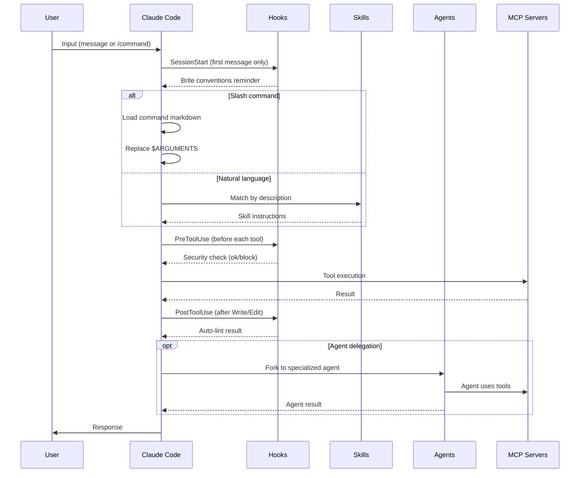
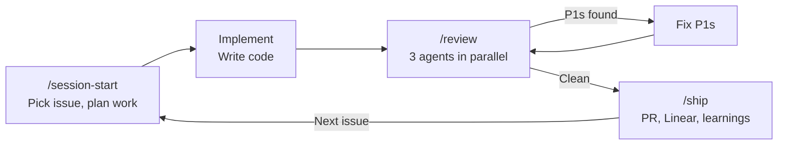

# Architecture

How the Brite Claude Plugins bundle is structured, how it executes, and why it's built this way.

## System Overview


The plugin is a **single-plugin bundle**: one marketplace, one plugin. This keeps distribution simple while allowing future plugins to be added to the same bundle.

## Plugin Resolution

When a user installs the bundle, Claude Code:

1. Reads `.claude-plugin/marketplace.json` to discover available plugins
2. Follows the `source` path (e.g., `./plugins/workflows`) to find the plugin directory
3. Reads `plugins/workflows/.claude-plugin/plugin.json` for metadata and component paths
4. Loads commands from `./commands/`, skills from `./skills/`, agents from `./agents/`
5. Registers hooks from `./hooks/hooks.json` (auto-discovered, not declared in plugin.json)
6. Configures MCP servers from `./.mcp.json`

All paths in `plugin.json` are relative to the plugin root (`plugins/workflows/`).

## Runtime Flow



## Skill Routing

Skills activate based on their `description` field — Claude reads descriptions and selects the best match for the user's intent.

### Design Skills (Three-Way Split)

| Skill | Triggers | Purpose | Example Prompt |
|-------|----------|---------|----------------|
| `frontend-design` | "build", "create", "implement" UI | Write production code | "Build a dashboard with Tailwind" |
| `ui-ux-pro-max` | "choose palette", "design system", "plan visual direction" | Design planning & exploration | "Help me pick colors for a SaaS app" |
| `web-design-guidelines` | "review", "audit", "check" existing UI | Compliance review | "Review my landing page for accessibility" |

### Other Skills

| Skill | Domain | Trigger |
|-------|--------|---------|
| `react-best-practices` | React / Next.js | Writing, reviewing, or optimizing React components |
| `agent-browser` | Browser automation | Navigating websites, filling forms, screenshots |
| `find-skills` | Skill discovery | Looking for new skills or capabilities |
| `post-plan-setup` | Project workflow | After `/plan-project` produces a v1 plan |
| `refine-plan` | Plan refinement | Called by post-plan-setup (not user-invocable) |
| `create-issues` | Issue creation | Called by post-plan-setup (not user-invocable) |
| `setup-claude-md` | CLAUDE.md generation | Called by post-plan-setup (not user-invocable) |

## Post-Plan Workflow

The post-plan workflow is the most complex subsystem — an orchestrated pipeline of 3 skills + 4 agents.


**Flow:**
1. User invokes `/workflows:post-plan-setup <plan-path>`
2. **Phase 1 — Refine Plan**: `refine-plan` decomposes the v1 plan into agent-ready tasks with context, steps, and validation criteria. Outputs `docs/project-plan-refined.md`.
3. *Pause for user review*
4. **Phase 2 — Create Issues**: `create-issues` creates Linear issues from the refined plan via MCP. Updates the plan file with issue IDs.
5. *Pause for user review*
6. **Phase 3 — Setup CLAUDE.md**: `setup-claude-md` analyzes the codebase and generates a best-practices CLAUDE.md.
7. *Pause for user review*

**Agent model selection:**
- `plan-refiner`, `issue-creator`, `post-plan-orchestrator` use **opus** — complex reasoning and multi-step coordination
- `claude-md-generator` uses **sonnet** — structured generation from clear templates, doesn't need opus-level reasoning

**Known limitation:** Sub-skills declare `context: fork` for isolated agent execution, but this feature has upstream bugs ([#16803](https://github.com/anthropics/claude-code/issues/16803), [#17283](https://github.com/anthropics/claude-code/issues/17283)). Currently, skills run inline in the parent context.

## Session Workflow

The v2.0.0 session commands create a complete development loop:



**`/session-start`**: Pulls latest, queries Linear for open issues, helps pick one, creates an execution plan.

**`/review`**: Runs `code-reviewer`, `security-reviewer`, and `typescript-reviewer` agents in parallel (all sonnet). Auto-fixes P1s, reports P2/P3s.

**`/ship`**: Creates PR, updates Linear issue status, compounds learnings to CLAUDE.md and memory, suggests next issue.

### Review Agents

| Agent | Model | Focus |
|-------|-------|-------|
| `code-reviewer` | sonnet | Bugs, logic errors, edge cases, P1/P2/P3 severity |
| `security-reviewer` | sonnet | OWASP Top 10, secrets exposure, auth issues |
| `typescript-reviewer` | sonnet | Type safety, React/Next.js patterns, hook rules |

All three produce findings in the same `**[P1/P2/P3]** file:line — title` format for consistent output.

## Hook Execution

Hooks use a **two-layer security architecture**: deterministic regex command hooks run first (fast, no LLM), then haiku prompt hooks as fallback for anything the regex misses.

| Event | Matcher | Layer | Type | What It Checks |
|-------|---------|-------|------|----------------|
| `PreToolUse` | `Bash` | 1 (regex) | command | Blocks `rm -rf`, `--force`, `DROP`, `chmod 777`, piped downloads |
| `PreToolUse` | `Bash` | 2 (fallback) | prompt | Haiku evaluates anything not caught by regex |
| `PreToolUse` | `Write\|Edit` | 1 (regex) | command | Blocks `sk-proj-`, `AKIA`, `ghp_`, `sk_live/test` patterns |
| `PreToolUse` | `Write\|Edit` | 2 (fallback) | prompt | Haiku evaluates anything not caught by regex |
| `PostToolUse` | `Write\|Edit` | — | command | Auto-lint: ESLint (JS/TS) or Ruff (Python) if installed |
| `SessionStart` | `startup` | — | prompt | Reminds Claude of Brite conventions |

**Why two layers?** Regex command hooks are deterministic and instant — they catch known-bad patterns without LLM latency or cost. The haiku prompt hook catches novel threats the regex misses.

**Why command (not prompt) for the linter?** Linting is deterministic — no LLM judgment needed. A shell command is faster and more reliable.

## Agent Delegation

Skills can reference agents via the `agent:` frontmatter field. The agent definition (in `agents/*.md`) specifies:

- `model`: Which Claude model to use
- `tools`: Allowed tool list (scoped for safety)
- System prompt with role and principles

Agents are more constrained than the parent session — they receive only the tools listed in their definition, preventing scope creep.

## MCP Server Integration

| Server | Transport | Package / URL | Purpose |
|--------|-----------|---------------|---------|
| `sequential-thinking` | stdio | `@modelcontextprotocol/server-sequential-thinking` | Structured multi-step reasoning for complex analysis |
| `linear-server` | HTTP | `https://mcp.linear.app/mcp` | Linear project management — issues, projects, teams |

`sequential-thinking` is used by the post-plan skills for plan decomposition and analysis. `linear-server` is used by `create-issues` to create and manage Linear issues.

## Shared Utilities

Two files in `skills/_shared/` are referenced by multiple skills:

| File | Purpose | Used By |
|------|---------|---------|
| `validation-pattern.md` | Self-validation and retry loop (check → evaluate → retry up to 3x → flag for human) | refine-plan, create-issues, setup-claude-md |
| `output-formats.md` | Standard severity levels, finding format, summary blocks, progress format | code-review command, review-type skills |

These prevent duplication — skills reference them rather than embedding their own validation/formatting logic.

## Design Decisions

| Decision | Rationale |
|----------|-----------|
| Single plugin in marketplace | Simplicity — one bundle, one plugin. Add more plugins later if needed. |
| Description-based skill routing | Claude's native matching; no custom router needed. Descriptions must be distinct enough to avoid conflicts. |
| Haiku for security hooks | Fast (< 10s), cheap, sufficient for pattern matching. Doesn't block developer flow. |
| Opus for orchestrator agents | Complex multi-step coordination and reasoning. Worth the cost for plan quality. |
| Sonnet for CLAUDE.md generation | Structured output from clear templates. Opus would be overkill. |
| No build process | Plugin is pure markdown/JSON. No compilation, no dependencies, no lock files. |
| `context: fork` declared but not functional | Documents intended architecture. Will work when upstream bugs are fixed. |
| Shared utilities in `_shared/` | Prevents validation/formatting logic from being duplicated across skills. |
| Commands use `$ARGUMENTS` | Claude Code's native variable substitution. No custom parsing needed. |
| Hooks use separate file (`hooks.json`) | Cleaner than inline in plugin.json. Easier to review and modify. |

## File Map

Quick reference for finding things:

```
.claude-plugin/marketplace.json       # Bundle registry
plugins/workflows/
  .claude-plugin/plugin.json          # Plugin metadata (v2.0.0)
  commands/
    session-start.md                  # Pick a Linear issue, plan work
    review.md                         # Run review agents, fix P1s
    ship.md                           # Create PR, update Linear, learnings
    project-start.md                  # Guided project setup interview
    tech-stack.md                     # Display tech stack for decisions
    code-review.md                    # Standardized code review
    onboarding-checklist.md           # New dev environment setup
  skills/
    agent-browser/SKILL.md            # Browser automation
    find-skills/SKILL.md              # Skill discovery
    frontend-design/SKILL.md          # UI implementation (production code)
    react-best-practices/SKILL.md     # 45 Vercel React/Next.js rules
    ui-ux-pro-max/SKILL.md            # Design planning & exploration
    web-design-guidelines/SKILL.md    # UI compliance review
    post-plan-setup/SKILL.md          # Workflow orchestrator
    refine-plan/SKILL.md              # Plan → agent-ready tasks
    create-issues/SKILL.md            # Tasks → Linear issues
    setup-claude-md/SKILL.md          # Generate CLAUDE.md
    _shared/
      validation-pattern.md           # Self-validation & retry loop
      output-formats.md               # Standard output formatting
  agents/
    code-reviewer.md                  # Code quality reviewer (sonnet)
    security-reviewer.md              # Security vulnerability reviewer (sonnet)
    typescript-reviewer.md            # TypeScript/React reviewer (sonnet)
    post-plan-orchestrator.md         # Orchestrator agent (opus)
    plan-refiner.md                   # Plan refinement agent (opus)
    issue-creator.md                  # Issue creation agent (opus)
    claude-md-generator.md            # CLAUDE.md generation agent (sonnet)
  hooks/hooks.json                    # Two-layer security + lint + session hooks
  .mcp.json                           # MCP server configs
```
