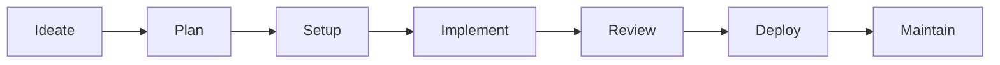

# Roadmap

The vision, current state, and development plan for the Britenites Claude Plugins bundle.

For detailed issue tracking, see the [Linear project](https://linear.app/brite-nites/project/brite-claude-code-plugin-402b57908532).

## Vision

Britenites Claude Plugins aims to be a **full project lifecycle platform** — a single plugin bundle that supports every phase of software development, from initial idea to long-term maintenance.

**7 phases. One plugin. Every developer workflow covered.**

## Current Coverage (v2.0.1)

| Phase | Coverage | Components |
|-------|----------|------------|
| **Ideate** | None | — |
| **Plan** | Partial | `/project-start` command, `/tech-stack` command |
| **Setup** | Strong | `post-plan-setup` orchestrator, `refine-plan`, `create-issues`, `setup-claude-md` skills, `/onboarding-checklist` command |
| **Implement** | Partial | `/session-start` command, `frontend-design`, `ui-ux-pro-max`, `react-best-practices`, `agent-browser` skills |
| **Review** | Strong | `/review` command (3 agents in parallel), `/code-review` command, `web-design-guidelines` skill, `code-reviewer`, `security-reviewer`, `typescript-reviewer` agents |
| **Deploy** | Partial | `/ship` command (PR creation, Linear updates, learning compounding) |
| **Maintain** | None | — |

**Also available:** `find-skills` (skill discovery), `sequential-thinking` MCP (structured reasoning), `linear-server` MCP (issue management), two-layer security hooks, auto-linter hook.

## Competitive Context

The Claude Code plugin ecosystem is growing (9,000+ plugins in early 2026). Britenites differentiates on five axes:

1. **Lifecycle breadth** — Most plugins are single-purpose. We cover multiple phases with a coordinated toolset.
2. **Agent-ready architecture** — Skills produce structured output designed for AI agents, not just human readers.
3. **Orchestrated workflows** — The post-plan pipeline chains multiple skills with human checkpoints.
4. **Opinionated but extensible** — Strong defaults (tech stack, code review checklists) that teams can override.
5. **Internal-first quality** — Built for daily use by our team, not for marketplace downloads.

## Development Phases

### Phase 1: Foundation (Complete)

**v1.0.0 – v2.0.0** | Shipped Feb 2026

What was built:
- Plugin bundle infrastructure (marketplace, plugin.json, CI validation)
- 7 commands: `session-start`, `review`, `ship`, `project-start`, `tech-stack`, `code-review`, `onboarding-checklist`
- 10 skills across design, frontend, planning, and workflow automation
- 7 agents: 4 post-plan orchestration + 3 review agents (`code-reviewer`, `security-reviewer`, `typescript-reviewer`)
- Two-layer hook security: regex command hooks (deterministic) + haiku prompt hooks (fallback)
- Auto-linter hook (PostToolUse) and session context hook (SessionStart)
- MCP integrations: sequential-thinking, linear-server
- Shared utilities: validation-pattern, output-formats
- Documentation: README, CHANGELOG, ROADMAP, ARCHITECTURE, CONTRIBUTING, CLAUDE.md

### Phase 2: Command Library Expansion

**Target:** Mar 9, 2026

Documentation (complete in v1.5.0–v2.0.0):
- ~~ARCHITECTURE.md — system diagrams and design decisions~~ Done
- ~~CONTRIBUTING.md — internal contributor guide~~ Done
- ~~Getting started and troubleshooting guides~~ Done

New commands:
- `deploy` — production deployment workflow
- `db-migrate` — database migration runner with safety checks
- `sprint-status` — pull sprint status from Linear

### Phase 3: Ideation Phase Tools

**Target:** Mar 23, 2026

Fill the empty "Ideate" phase:
- `brainstorm` skill — structured ideation with diverge/converge framework
- `competitive-analysis` skill — research competitors and synthesize findings
- `user-research` command — user interview guide and synthesis template
- `problem-definition` skill — problem statement and hypothesis generation

### Phase 4: Expand Implementation Phase

**Target:** Apr 6, 2026

Broaden beyond frontend/design:
- `fastapi-patterns` skill — FastAPI best practices and patterns
- `database-design` skill — schema design, normalization, migration patterns
- `api-design` skill — REST/GraphQL API design guidelines
- `docker-compose` skill — container configuration for local dev
- `testing-strategy` skill — test pyramid, coverage targets, framework selection

### Phase 5: Deploy Phase Tools

**Target:** Apr 20, 2026

Fill the empty "Deploy" phase:
- `deploy` skill — deployment workflow with pre-flight checks
- `ci-cd-setup` skill — GitHub Actions / CI pipeline configuration
- `environment-config` skill — environment variable management and secrets
- `release-notes` command — generate release notes from changelog and PRs

### Phase 6: Maintain & Monitor Phase

**Target:** May 4, 2026

Fill the empty "Maintain" phase:
- `dependency-audit` skill — check for outdated/vulnerable dependencies
- `performance-monitor` skill — performance regression detection
- `incident-response` skill — incident triage and communication templates
- `tech-debt-tracker` skill — identify and categorize technical debt
- `log-analysis` skill — structured log analysis and alerting patterns

### Phase 7: Automation & Polish

**Target:** May 18, 2026

Platform maturity:
- Resolve `context: fork` — when upstream bugs ([#16803](https://github.com/anthropics/claude-code/issues/16803), [#17283](https://github.com/anthropics/claude-code/issues/17283)) are fixed, validate agent isolation works
- Output styles — configurable response formatting (concise, verbose, educational)
- Agent handoff protocol — standardized protocol for multi-agent collaboration
- Plugin metrics — track which commands/skills are used and how often
- Cross-skill context sharing — skills that build on each other's output

## Long-Term Vision

Once all 7 lifecycle phases have coverage:

- **Full lifecycle coverage** — A developer can go from "I have an idea" to "it's in production and monitored" without leaving Claude Code
- **Agent collaboration** — Multiple agents working on different parts of a project simultaneously, coordinated by orchestrator skills
- **Cross-project learning** — Skills that learn patterns from one project and apply them to the next (via CLAUDE.md generation and shared conventions)
- **Team-specific customization** — Override any skill's behavior with team-specific conventions without forking the plugin

The plugin grows with the team. Every workflow friction point becomes a candidate for a new command or skill.
